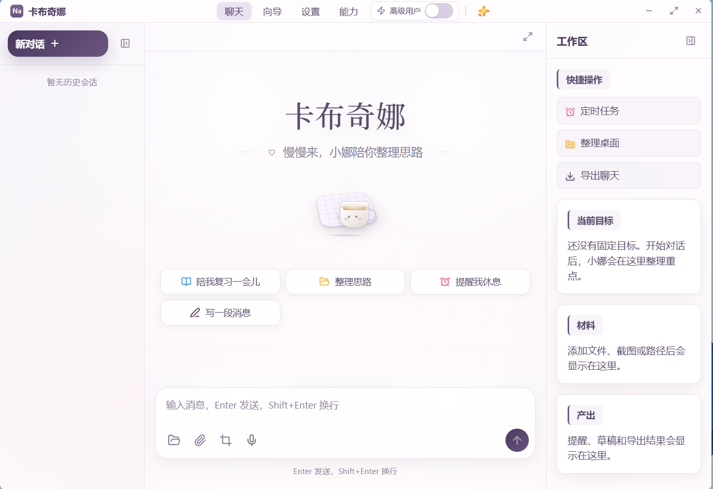
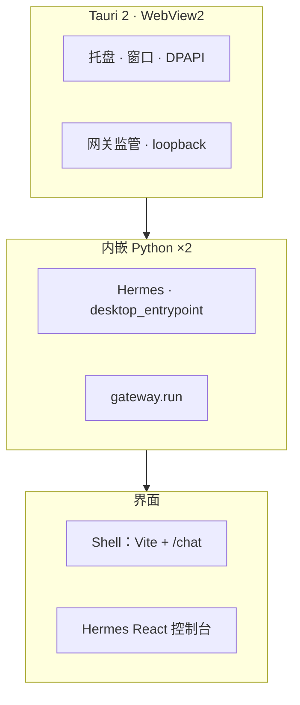
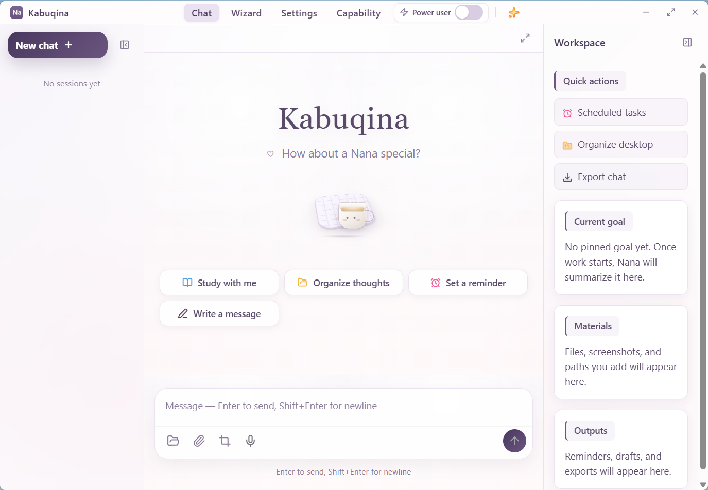
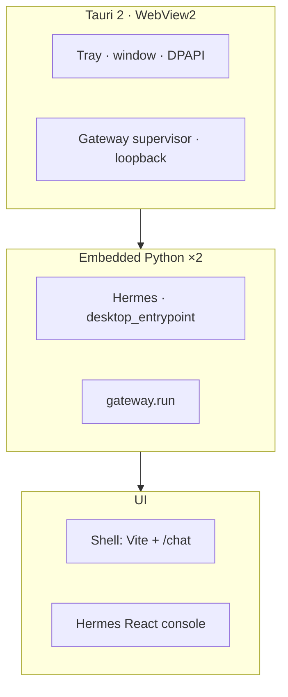

<div align="center">

# 卡布奇娜 · Kabuqina

**Windows 上好安装的桌面 AI 助手** · 向导配置 · BYO API Key · 基于 [Hermes Agent](https://github.com/NousResearch/hermes-agent)

[](LICENSE)
[](https://github.com/Kabuqina/Kabuqina)
[](https://tauri.app)
[](./tauri/tauri.conf.json)

[**简体中文**](#简体中文) · [**English**](#english) · [文档索引](./docs/README.md) · [排障](./docs/troubleshooting.md)

</div>

> **License notice:** Source code is [MIT](./LICENSE). The **Kabuqina / 卡布奇娜 name,
> logos, mascot, and icons** are **proprietary** and **not** included under MIT.
> See [BRAND.md](./BRAND.md) and [assets/brand/LICENSE](./assets/brand/LICENSE).

---

## 简体中文

### 一句话

**卡布奇娜**是在 **Windows** 上用的 **桌面版 AI 助手**：像普通软件一样安装打开，自带引导配置 **自己的大模型 API Key**，底层跑开源的 **[Hermes Agent](https://github.com/NousResearch/hermes-agent)**。

### 适合你吗

|          |                                                                                                                               |
| -------- | ----------------------------------------------------------------------------------------------------------------------------- |
| **目标用户** | 想要 **本机窗口 + 托盘**，不想折腾终端、也不想长期挂在浏览器标签里                                                                                         |
| **费用**   | **自备 Key（BYO）** — 向导里可配 OpenRouter、OpenAI、Anthropic 或自定义 Base URL                                                             |
| **文件**   | 默认围绕 **一个工作区文件夹**，降低误操作面                                                                                                      |
| **技术形态** | **Tauri 2**（引导、`/chat`、设置、消息网关控制）+ **内嵌 Python**：`desktop_entrypoint` 与 **`gateway.run`**；**WebView2** 中可开完整 Hermes React 控制台 |

> **阶段：内测 / 0.1+** — 引导 → 保存 key → 壳内对话 与/或 Hermes 全界面 · 可选多通道网关 · 工作区与 **超级用户** 分权。安装包可用，体验会持续迭代。详见 [架构](./docs/architecture.md) · [路线图](./docs/ROADMAP.md)。

### 界面截图

<p align="center">
  <br/>
  <sub>壳内对话（<code>/chat</code>）</sub>
</p>

### 安装（最终用户）

从 **GitHub Releases** 获取最新 Windows 安装包（名称以发布页为准），例如：

- `Kabuqina_0.1.0_x64_en-US.msi`

内含 Tauri 壳、前端资源、内嵌 Python / Hermes 运行时。尚未代码签名时，SmartScreen 可能提示未知发布者 → [代码签名](./docs/code-signing.md)。

### 能力与边界

<details>
<summary><strong>能做什么 · 网关与 0.1.x 摘要</strong>（点击展开）</summary>

**消息网关（已落地）：** 本地 **`python -m gateway.run`** 独立子进程。引导/设置中已走通五条渠道：

- **Telegram** — `@BotFather` token → `TELEGRAM_BOT_TOKEN`
- **邮件（IMAP/SMTP）** — 写入 `EMAIL_*` 至 `hermes-home/.env`
- **微信（个微）** — 扫码；`WEIXIN_*` · 配对策略见应用内文案
- **QQ 机器人** — 扫码绑定；`QQ_*`
- **飞书 / Lark** — 扫码自建应用；`FEISHU_*`

控制入口：**设置 → 消息网关**。LLM Key 与各机器人共用 Windows 凭据。设计沿革：[gateway-desk-weixin-strategy](./docs/gateway-desk-weixin-strategy.md) · [route-c-validation](./docs/gateway-route-c-weixin-validation.md)。

**0.1.x 能力摘要：** 壳内 `/chat`、设置（含超级用户 **重启 Python 子进程**）、`desk_system_prompt` 约束、托盘与品牌资源、`hermes/web` 控制台复制；网关同上。

详细对比仍见下文「不做」条目。

</details>

| ✓ 能做的                                    | ✗ 不承诺的                                                                                                             |
| ---------------------------------------- | ------------------------------------------------------------------------------------------------------------------ |
| **`.msi`** 桌面分发 · 托盘、窗口 · **DPAPI** 密钥逻辑 | **不是** 上游 Hermes **每一个**能力与适配器的 1:1 镜像（深度 RL、完整 MCP 等请用 [上游 Hermes](https://github.com/NousResearch/hermes-agent)） |
| 短引导 · 壳内 **/chat** 或 **Hermes** 控制台      | **不是** 我们托管的云服务 — **推理账单在你选的供应商**                                                                                  |
| 可选 **网关** · 默认安全工作区与高敏工具 **`超级用户`** 开关   | 「未在 Desk 测试中列明的适配器」不保证开箱即用                                                                                         |

---

### 架构一览



与 English 小节中的图为同一结构。

<details>
<summary><strong>目录结构</strong></summary>

```
Kabuqina/
├── tauri/        桌面壳（Rust + Tauri 2）
├── python/       打包、overlay、policy、测试
├── web/          壳引导与设置（Hermes SPA 源码在 hermes_core/web）
├── hermes_core/  冻结的上游 Hermes 快照
└── docs/         架构、安全、Skills、排障
```

</details>

### 从源码构建（Windows）

**环境：** Rust **1.80+**、Node **20+**、PowerShell **7+**。Release 建议使用 **Developer PowerShell**（MSVC）；说明见 [embedded-python-bundled](./docs/embedded-python-bundled.md)。

```powershell
git clone https://github.com/Kabuqina/Kabuqina.git
cd Kabuqina

# Python 运行时（首次会下载独立 CPython）；可选：验证加 -Verify
.\python\build_bundle.ps1

# 可选：刷新托盘/应用图标 → `cd tauri` 后
# cargo tauri icon ..\web\public\kabuqina_na_blue_256.png

# 可选单元测试（L1）
Set-Location python; python -m unittest discover -s tests -p "test_*.py" -v; Set-Location ..

# Shell 前端（`npm run build` 使用 tsc --noEmit，避免 Windows 锁 tsbuildinfo）
Set-Location web; npm ci; npm run build; Set-Location ..

# 二选一：
# （A）开发预览 —— 会持续占用终端，CTRL+C 结束后再执行其它命令
Set-Location tauri; cargo tauri dev

# （B）打安装包 MSI
# Set-Location tauri; cargo tauri build; Set-Location ..
```

| 产出     | 路径                                                                                                                         |
| ------ | -------------------------------------------------------------------------------------------------------------------------- |
| 安装包    | `tauri\target\release\bundle\msi\Kabuqina_0.1.0_x64_en-US.msi`                                                             |
| 本体 exe | `tauri\target\release\kabuqina.exe`（对外分发优先 **MSI**）                                                                        |
| 便携 ZIP | **`.\scripts\package-portable-windows.ps1`** → `portable-dist\Kabuqina-<ver>-win64-portable.zip`（解压后运行 **`kabuqina.exe`**） |

- **便携 ZIP 写在哪儿：** 默认在仓库根下的 **`portable-dist\`**；打包前的展开草稿在 **`_staging_portable\`**（可用 **`.\scripts\package-portable-windows.ps1 -OutDir <路径>`** 改 ZIP 目录）。

- **`portable-dist` 为什么会出现不了：** 这个目录只在 **打包脚本执行成功之后**才有；单靠 `cargo build` / MSI 不会产生。在仓库根执行 **`.\scripts\package-portable-windows.ps1`** 前请先具备 **`tauri\target\release\kabuqina.exe`**（release 已过链接）以及 **`python\dist\runtime`**（先跑 **`.\python\build_bundle.ps1`**）。

- **常见问题**：[troubleshooting.md](./docs/troubleshooting.md)（代理与 loopback、WebView、网关 exit 1 等）

- **Skills**： [skills-security](./docs/skills-security.md) · [skills-design-decision](./docs/skills-design-decision.md)

### 协议

[**MIT**](LICENSE)（**仅源代码**）。品牌视觉资产（logo、mascot、图标）与 README 截图 **不在 MIT 范围内**，见 [BRAND.md](./BRAND.md)。Hermes 亦为 MIT，见其 [hermes_core/LICENSE](./hermes_core/LICENSE)。致谢 [Nous Research](https://nousresearch.com)。

---

<div align="center">

**──────────────── English ────────────────**

</div>

## English

**A friendly Windows desktop AI assistant** — double-click install, guided setup, your own API key.
Powered by the open-source **[Hermes Agent](https://github.com/NousResearch/hermes-agent)**.

**Packaged version:** `0.1.0` (`tauri/tauri.conf.json`, `web/package.json`).

### Install

Grab the latest **`.msi`** from **GitHub Releases** (exact filename follows the release), e.g. `Kabuqina_0.1.0_x64_en-US.msi`.
Unsigned builds may trigger SmartScreen — see [code-signing.md](./docs/code-signing.md).

### Screenshots

<p align="center">
  <br/>
  <sub>In-shell chat (<code>/chat</code>)</sub>
</p>

### At a glance

|           |                                                                                                                 |
| --------- | --------------------------------------------------------------------------------------------------------------- |
| **Who**   | People who want a **native Windows app**, not a terminal or a browser tab                                       |
| **Cost**  | **BYO key** — OpenRouter, OpenAI, Anthropic, or custom base URL                                                 |
| **Files** | A **single workspace folder** (safe-by-default)                                                                 |
| **Stack** | **Tauri 2** + **embedded Python** (`desktop_entrypoint` + **`gateway.run`**) + **Hermes React** in **WebView2** |

> **Alpha (0.1+)** — onboarding → key → shell chat and/or full Hermes UI, optional **messaging gateway**, workspace + **power user** gating. Polishing continues. [Architecture](./docs/architecture.md) · [Roadmap](./docs/ROADMAP.md).

<details>
<summary><strong>Messaging gateway & 0.1.x highlights</strong> (expand)</summary>

Five desk-tested adapters: **Telegram** (BotFather token), **Email** (IMAP/SMTP → `hermes-home/.env`), **Weixin** (QR / iLink), **QQ Bot**, **Feishu / Lark**. Second Python process; same Windows Credential Manager for LLM keys. Controls: **Settings → Messaging Gateway**. Design notes: [gateway-desk-weixin-strategy](./docs/gateway-desk-weixin-strategy.md), [gateway-route-c-weixin-validation](./docs/gateway-route-c-weixin-validation.md).

Highlights: in-shell **`/chat`**, settings (**power user** toggles restart the Python child), `desk_system_prompt` overlay for honest capability limits, branding under `web/public/`, Hermes desk chat copy affordance; gateway as above.

</details>

| ✓ Does                                                               | ✗ Does not claim to be                                                                                                                       |
| -------------------------------------------------------------------- | -------------------------------------------------------------------------------------------------------------------------------------------- |
| **`.msi`** distribution, tray/window **DPAPI** secrets               | Drop-in parity with **every** upstream Hermes feature on day one (see upstream [Hermes Agent](https://github.com/NousResearch/hermes-agent)) |
| Onboarding, **shell chat**, Hermes console in-webview                | A hosted inference SaaS — **you** pay the provider                                                                                           |
| Optional **gateway**; safe defaults + **power user** for risky tools | Every third-party adapter beyond the five bundled channels                                                                                   |

### Architecture



<details>
<summary><strong>Repo layout</strong></summary>

```
Kabuqina/
├── tauri/        Tauri 2 shell
├── python/       Bundle scripts, overlays, policy, tests
├── web/          Shell UI (Hermes SPA under hermes_core/web)
├── hermes_core/  Frozen upstream snapshot
└── docs/         Architecture, safety, troubleshooting
```

</details>

### Build from source

**Needs:** Rust **1.80+**, Node **20+**, PowerShell **7+**. Prefer **Developer PowerShell** for release builds — [embedded-python-bundled.md](./docs/embedded-python-bundled.md).

```powershell
git clone https://github.com/Kabuqina/Kabuqina.git
cd Kabuqina

.\python\build_bundle.ps1

# Optional: refresh icons → from `tauri/`:
# cargo tauri icon ..\web\public\kabuqina_na_blue_256.png

Set-Location python; python -m unittest discover -s tests -p "test_*.py" -v; Set-Location ..

Set-Location web; npm ci; npm run build; Set-Location ..

# (A) Dev — blocks until CTRL+C
Set-Location tauri; cargo tauri dev

# (B) Release MSI
# Set-Location tauri; cargo tauri build; Set-Location ..
```

| Output       | Path                                                                                                                               |
| ------------ | ---------------------------------------------------------------------------------------------------------------------------------- |
| Installer    | `tauri\target\release\bundle\msi\Kabuqina_0.1.0_x64_en-US.msi`                                                                     |
| Binary       | `tauri\target\release\kabuqina.exe` — **ship the MSI** for end users                                                               |
| Portable ZIP | **`.\scripts\package-portable-windows.ps1`** → `portable-dist\Kabuqina-<ver>-win64-portable.zip` (extract, run **`kabuqina.exe`**) |

- **Where the ZIP lands:** Repo root **`portable-dist/`** by default; expanded staging **`_staging_portable/`**. Override ZIP output with **`.\scripts\package-portable-windows.ps1 -OutDir <path>`**.

- **If those folders don't exist:** they are created **only after** **`.\scripts\package-portable-windows.ps1`** finishes successfully (`cargo`/MSI won't create them). Prerequisites: **`tauri/target/release/kabuqina.exe`** and **`python/dist/runtime`** (from **`.\python\build_bundle.ps1`**).

- **Troubleshooting:** [docs/troubleshooting.md](./docs/troubleshooting.md)

- **Skills:** [skills-security.md](./docs/skills-security.md) · [skills-design-decision.md](./docs/skills-design-decision.md)

### License

**MIT** for **source code** only — [LICENSE](LICENSE). **Brand assets** (name, logos, mascot, icons) and README screenshots are **proprietary** — [BRAND.md](BRAND.md). Hermes: [hermes_core/LICENSE](hermes_core/LICENSE). Thanks to **[Nous Research](https://nousresearch.com)**.
